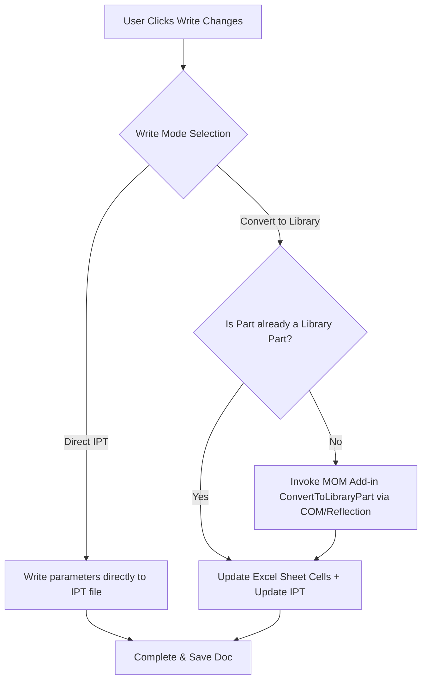

# Implementation Plan: Excel-Driven Library Part Write-Back & Conversion

This document details the step-by-step implementation plan for introducing Excel-driven library part updates and on-demand conversion to the **Unit Construction Verifier (UCV)**.

---

## 1. Objectives

1. **Option A: Symmetrical Excel Write-Back (Automatic)**
   - Detect if a modified part is already driven by an Excel spreadsheet.
   - Write overrides (Thickness, Gauge, Material) directly into the Excel spreadsheet cells instead of hard-modifying the `.IPT` file.
   - Recalculate and reload the part geometry automatically.

2. **Option B: Convert plain parts to Library Parts (On-Demand)**
   - Expose a UI toggle/dropdown in the UCV window to switch write-back modes between "Direct IPT Parameter Write" and "Convert to Library Part".
   - Delegate the conversion process to the running instance of the JCI MOM Add-in to reuse template caching, geometry derivation, and punch-hole recreation logic.
   - Run the conversion in a background task to prevent CAD application freezing.

---

## 2. Proposed Architectural Changes



---

## 3. Detailed Component Modifications

### Component 1: Reflection Helper for SpreadsheetGear and MOM Add-In
Create a new utility class `UnitConstructionVerifier.Operations.MomInteractionHelper` to handle communications with both the `BoundaryExcelSpreadsheetGear` assembly and the MOM Add-in.

#### [NEW] [MomInteractionHelper.cs](file:///c:/Users/jbrow263/OneDrive%20-%20Johnson%20Controls/Documents/Inventor%20Projects/UnitConstructionVerifier/UnitConstructionVerifier/Operations/MomInteractionHelper.cs)
```csharp
using System;
using System.Linq;
using System.Reflection;
using Inventor;

namespace UnitConstructionVerifier.Operations
{
    public static class MomInteractionHelper
    {
        private const string MomAddInGuid = "{8056411e-f31d-4ec5-a172-4a874bbea3aa}";
        private static Type _excelType;

        /// <summary>
        /// Reads or writes parameters to a linked Excel sheet using the already loaded MOM Excel assembly.
        /// </summary>
        public static bool UpdateExcelSpreadsheet(string excelPath, string thickness, string gauge, string material, out string error)
        {
            error = string.Empty;
            try
            {
                if (_excelType == null)
                {
                    var assy = AppDomain.CurrentDomain.GetAssemblies()
                        .FirstOrDefault(a => a.GetName().Name == "BoundaryExcelSpreadsheetGear");
                    if (assy == null)
                    {
                        error = "BoundaryExcelSpreadsheetGear assembly is not loaded in the active CAD AppDomain.";
                        return false;
                    }
                    _excelType = assy.GetType("BoundaryExcelSpreadsheetGear.CBoundaryExcel");
                }

                object excelInstance = Activator.CreateInstance(_excelType);
                try
                {
                    _excelType.GetMethod("OpenSpreadsheet", new[] { typeof(string) })
                        ?.Invoke(excelInstance, new object[] { excelPath });

                    if (!string.IsNullOrEmpty(thickness))
                        _excelType.GetMethod("UpdateCell")?.Invoke(excelInstance, new object[] { "Thickness", thickness });

                    if (!string.IsNullOrEmpty(gauge))
                        _excelType.GetMethod("UpdateCell")?.Invoke(excelInstance, new object[] { "INPUT_PARAMETER_Mtl_Gauge", gauge });

                    if (!string.IsNullOrEmpty(material))
                        _excelType.GetMethod("UpdateCell")?.Invoke(excelInstance, new object[] { "MaterialType", material });

                    _excelType.GetMethod("CalculateFull")?.Invoke(excelInstance, null);
                    _excelType.GetMethod("Save")?.Invoke(excelInstance, null);
                    return true;
                }
                finally
                {
                    _excelType.GetMethod("CloseSpreadsheetWorkbook")?.Invoke(excelInstance, null);
                }
            }
            catch (Exception ex)
            {
                error = ex.InnerException?.Message ?? ex.Message;
                return false;
            }
        }

        /// <summary>
        /// Invokes the MOM Add-in's conversion routines on a target part occurrence.
        /// </summary>
        public static bool ConvertToLibraryPart(Application app, ComponentOccurrence occurrence, out string error)
        {
            error = string.Empty;
            try
            {
                var addIn = app.ApplicationAddIns.ItemById[MomAddInGuid];
                if (addIn == null || !addIn.Activated)
                {
                    error = "JCI MOM Add-in is not loaded or active in Inventor.";
                    return false;
                }

                object addInServer = addIn.AddInServer;
                
                // Retrieve the occurrence wrappers dynamically from BoundaryInventorCS assembly
                var inventorCsAssy = AppDomain.CurrentDomain.GetAssemblies()
                    .FirstOrDefault(a => a.GetName().Name == "BoundaryInventorCS");
                if (inventorCsAssy == null)
                {
                    error = "BoundaryInventorCS assembly not loaded.";
                    return false;
                }

                // Wrap occurrence: CComponentOccurrence wrapper = new CComponentOccurrence(occurrence);
                Type occType = inventorCsAssy.GetType("BoundaryInventorCS.Documents.CComponentOccurrence");
                object wrappedOcc = Activator.CreateInstance(occType, BindingFlags.NonPublic | BindingFlags.Public | BindingFlags.Instance, null, new object[] { occurrence }, null);

                // Call ConvertToLibraryPart via reflection on the running AddInServer
                MethodInfo convertMethod = addInServer.GetType().GetMethod("ConvertToLibraryPart", BindingFlags.NonPublic | BindingFlags.Instance);
                if (convertMethod == null)
                {
                    error = "Could not locate conversion method 'ConvertToLibraryPart' on AddInServer.";
                    return false;
                }

                convertMethod.Invoke(addInServer, new[] { wrappedOcc });
                return true;
            }
            catch (Exception ex)
            {
                error = ex.InnerException?.Message ?? ex.Message;
                return false;
            }
        }
    }
}
```

---

### Component 2: Write-Back Logic Updates in IptPropertyWriter

#### [MODIFY] [IptPropertyWriter.cs](file:///c:/Users/jbrow263/OneDrive%20-%20Johnson%20Controls/Documents/Inventor%20Projects/UnitConstructionVerifier/UnitConstructionVerifier/Operations/IptPropertyWriter.cs)
Integrate the Excel redirection check inside `UpdatePartProperties`.

```csharp
// Inside UpdatePartProperties
PropertySets sets = doc.PropertySets;
PropertySet userDefined = sets["Inventor User Defined Properties"];

// Check if parameter sheet table is linked
Parameters parameters = doc.ComponentDefinition.Parameters;
if (parameters.ParameterTables.Count > 0)
{
    string excelPath = parameters.ParameterTables[1].ReferencedFileDescriptor.FullFileName;
    
    // Write changes symmetrically to Excel instead of direct IPT modification
    bool success = MomInteractionHelper.UpdateExcelSpreadsheet(
        excelPath, 
        edits.Thickness, 
        edits.MtlGauge, 
        edits.YCMATL, 
        out string excelError
    );

    if (!success)
    {
        errorMessage = $"Excel write-back failed: {excelError}";
        return false;
    }

    // Still sync standard user iProperties for verification consistency
    if (edits.Thickness != null) WriteUserProperty(userDefined, "Thickness", edits.Thickness);
    if (edits.YCMATL != null) WriteUserProperty(userDefined, "YCMATL", edits.YCMATL);
    if (edits.MtlGauge != null) WriteUserProperty(userDefined, "INPUT_PARAMETER_Mtl_Gauge", edits.MtlGauge);

    doc.Update2(AcceptAll: true); // Force full geometry update from Excel link
    dirty = false; // We managed saving in Excel
}
else
{
    // Fall back to original direct parameters writing
    if (edits.Thickness != null)
    {
        dirty |= WriteUserProperty(userDefined, "Thickness", edits.Thickness);
        dirty |= WriteModelParameter(doc, "Thickness", edits.Thickness);
    }
    // ... rest of the original direct parameter writes
}
```

---

### Component 3: UI Options Mode Selection

#### [MODIFY] [VerifierWindow.xaml](file:///c:/Users/jbrow263/OneDrive%20-%20Johnson%20Controls/Documents/Inventor%20Projects/UnitConstructionVerifier/UnitConstructionVerifier/UI/VerifierWindow.xaml)
Introduce a Write Options configuration block in the Edit Mode toolbar.

```xml
<!-- Inserted above the Grid view or inside the header bar -->
<StackPanel Orientation="Horizontal" Margin="10,5,10,5" VerticalAlignment="Center">
    <TextBlock Text="Write-Back Strategy:" VerticalAlignment="Center" FontWeight="SemiBold" Margin="0,0,10,0"/>
    <ComboBox x:Name="cmbWriteStrategy" Width="200" SelectedIndex="0">
        <ComboBoxItem Content="Direct IPT (Standard)" ToolTip="Modifies parameters directly in the local IPT files."/>
        <ComboBoxItem Content="Convert to Library Part" ToolTip="Converts plain files to Excel-driven library parts on edit write-back."/>
    </ComboBox>
</StackPanel>
```

#### [MODIFY] [VerifierWindow.xaml.cs](file:///c:/Users/jbrow263/OneDrive%20-%20Johnson%20Controls/Documents/Inventor%20Projects/UnitConstructionVerifier/UnitConstructionVerifier/UI/VerifierWindow.xaml.cs)
Enhance the write loop to check the Selected Strategy. If "Convert to Library Part" is selected, trigger conversion for plain parts before writing.

```csharp
// Inside BtnWriteChanges_Click or groupedEdits write loop
bool convertPlainToLib = cmbWriteStrategy.SelectedIndex == 1;

foreach (var kvp in groupedEdits)
{
    string filePath = kvp.Key;
    Operations.PartPropertyEdits edits = kvp.Value;
    
    // Find the occurrence matching this file path in active assembly
    ComponentOccurrence occ = FindOccurrenceInDoc(_activeAssembly, filePath);

    if (convertPlainToLib && occ != null)
    {
        // Check if not already a library part
        if (occ.Definition.Document is PartDocument partDoc && partDoc.ComponentDefinition.Parameters.ParameterTables.Count == 0)
        {
            // Trigger background conversion
            bool converted = Operations.MomInteractionHelper.ConvertToLibraryPart(_inventorApp, occ, out string conversionError);
            if (!converted)
            {
                errorList.Add($"{Path.GetFileName(filePath)}: Conversion failed -> {conversionError}");
                continue;
            }
            
            // Re-resolve the filepath since occ.Replace replaces the document reference
            filePath = occ.Definition.Document.FullFileName;
        }
    }

    if (writer.UpdatePartProperties(filePath, edits, out string err))
    {
        successCount++;
    }
    else
    {
        errorList.Add($"{Path.GetFileName(filePath)}: {err}");
    }
}
```

---

## 4. Verification Plan

### Manual Test Cases

1. **Verify Existing Library Parts Update Symmetrically**
   - **Precondition**: Open an assembly containing a part already linked to an Excel spreadsheet (e.g. standard wall skin).
   - **Action**: Run UCV, modify the skin gauge/material, and execute "Write Changes".
   - **Expectation**: Confirm that the local Excel sheet (under the part folder) is modified, and the `.IPT` parameter table correctly reflects the change. Confirm that no link breaks occur in Inventor.

2. **Verify Plain-to-Library Part Conversion**
   - **Precondition**: Open an assembly containing a plain or standard non-library sheet metal part.
   - **Action**: Change UCV "Write-Back Strategy" to "Convert to Library Part". Edit thickness, click "Write Changes".
   - **Expectation**:
     - The verifier copies the library template from the local Vault cache.
     - A new subfolder is generated in the assembly directory containing the copied IPT, XLS, and IDW.
     - The part in the assembly is successfully replaced with the new library part occurrence.
     - Geometry is updated according to the values in the new Excel sheet.
